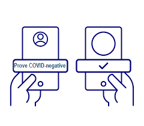
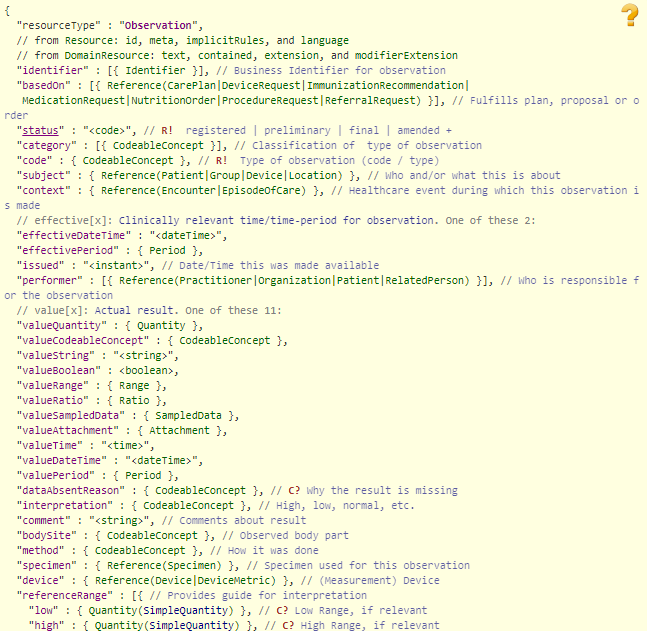
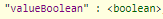
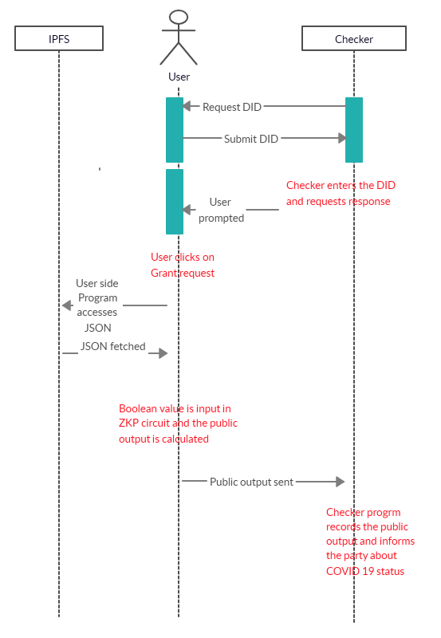
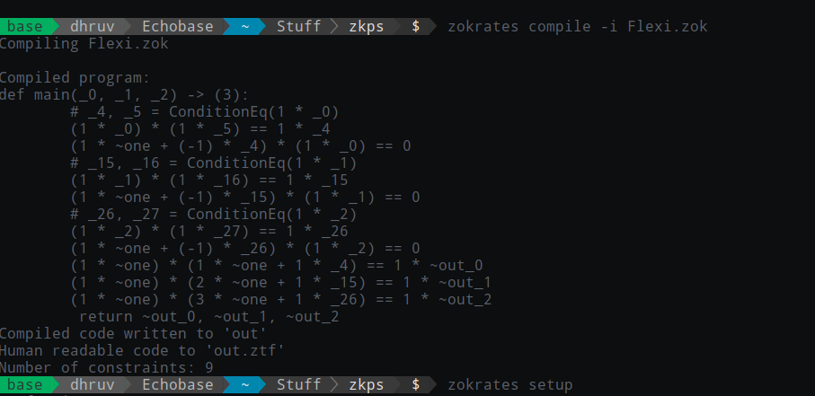
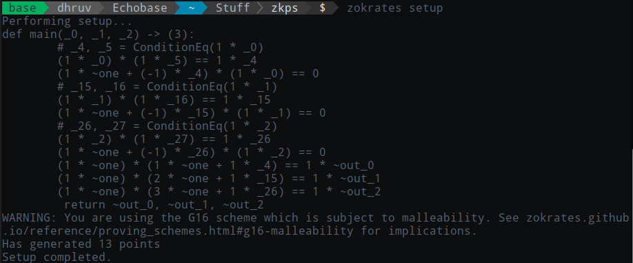
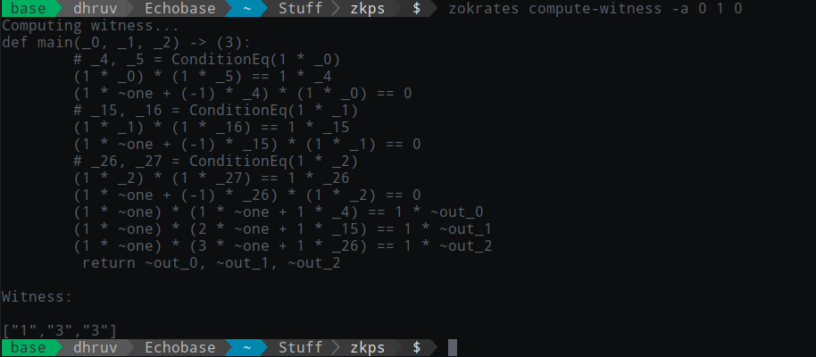
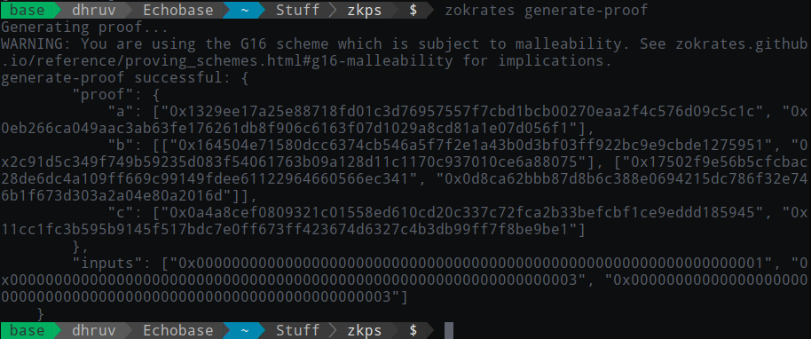
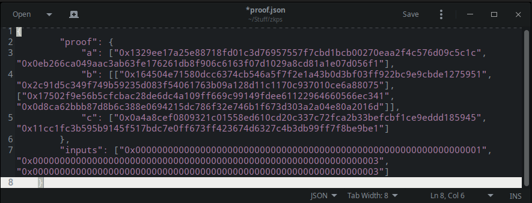

# How to run ZKP on a linux system:
	* Download the combined.zok and zkp.sh file from the repository.
	* Change the properties of zkp.sh file to executable
	* Open a terminal windoew in the folder
	* run ./zkp.sh

# ZK-Proofs in FlexiTest Port
We plan to implement multiple Zero Knowledge Proofs  in our project CryptoCare. The following content describes the ways we see the zkproof(s) being used in the project, covering the conceptual and functional aspects of it along the way. ZK-Proofs have undeniably become a benchmark in privacy protecting technologies.

The following implementations are subject to changes as per the latest HL7 FHIR release for the medical documents and JSON files.

## ZK Proof implementations :

### 1) check if the user has gone through the COVID19 test
The first ZK Proof is to verify if a user has gone through a COVID19 test anytime in the past. This is achieved by the user side program recording the timestamps (or count) of all the transactions that have taken place between the user, the lab and  the doctor.

Since we have a predefined order of the transactions that are supposed to happen between the parties, we can use a Zero Knowledge proof to verify if the user has taken the COVID19 test or not. The aim is to let the verifier know only the status of the result (delivered or pending).

The user side program checks for the count of the transactions taken place from the user’s wallet. Since, the order of transactions is predefined, there is just a fixed limit which the counter can hold.

Eg: Let’s say  according to the predefined order, the number of transactions can reach a maximum of 10 (at 10, the user is delivered the result of COVID19 test). 

A client side program sets a variable to the count. That value is then passed into a ZK Proof circuit. The circuit then outputs a binary value which is visible to the verifier program (The circuit outputs one value if the count is greater than 0, and another value if the count is a number in the range of 1-10). The verifier program provides the verifier with just the knowledge of, if the user has undergone the COVID19 test. Thus, preserving the privacy of the user by not revealing any piece of data to the verifier.

What are the variables ( to the circuit) : 

 -Count of number of tests completed  = n
 -Count of number of transactions on latest test = t
 -Is it ongoing test or not ( BOOLEAN ) = s
 
 
Steps:

1) The checker enters the user’s DID in the checker interface.

2) The user gets a notification pop up in the app asking for the user to grant the ZK Proof to run. The pop up contains the name of the checker and checker ID for the assurance of the user.

3) The user clicks ‘Allow’ in the user interface.

4) The user side program starts.

5) The program fetches the variable ‘s’.

6) The program fetches the variable ‘n’.

7) The program fetches the variable ‘t’.

8) These are sent in as the private inputs to the ZK analytical circuit.

9) The public output of the circuit is a boolean value which guides the checker side program to tell the checker about the status of the test.

### 2) To verify the COVID19 result of the user
   

 This ZK Proof verifies if the user has tested negative for Covid19.

The verifier here can be organizations such as the Police, airport authorities, event management authorities or any such organization who has gained the verifier status.

   

The above HL7 FHIR - JSON document which contains the user’s test result is stored in IPFS.
The user thus has the private key to access the file from IPFS.

Design 1: A common IPFS storage shared by the doctor, the patient, the lab and the checker.

Variables to the circuit:
Boolean value from the JSON. 

Steps:
1) The verifier enters the user DID.

2) The client side program extracts the JSON file from the IPFS storage using the private key of the user.
                    

3) The client side application runs a program to get the boolean value from the corresponding key from JSON file.

4) The value held by the Boolean key (0 or 1), is then entered into the  ZK Proof circuit. The circuit gets completed only if the private input is 0, which means the user tested ‘Negative’ in the last COVID19  test.

			Variable (0 or 1 ) -    checker

5) The verifier program records the public output and tells the verifier about the result of the user.

Thus, this Zero Knowledge proof successfully informs the verifier about the status of  
user’s COVID19 result without informing the verifier about any of the user details.

# Screenshots
   
#

### proof.json file for the verefier input

